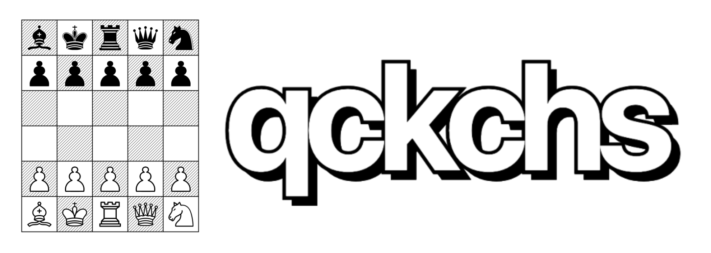

A fast-paced 5×6 chess variant. **Capture the king to win.**

Play it: **[qckchs.com](https://qckchs.com)**

## What's different

- **5 files × 6 ranks**, 30 squares total. Every game is close-quarters.
- **Capture the king to win.** No check, no checkmate. Leaving your king en prise is legal — your opponent has to actually take it.
- **Shuffled back rank.** Both sides start with the same Fisher-Yates permutation. Every game is a new opening.
- **Pure byoyomi clock.** 120 one-second periods. Move within 1s and the period resets free; slower burns one. Run out of periods and you lose. The clock never goes up.
- **Standard piece movement** otherwise — minus castling, en passant, and the two-square pawn opening. Pawns auto-queen on the back rank.

Draws on threefold repetition, 50-ply no-progress, and insufficient material.

## How to play

Open [qckchs.com](https://qckchs.com), pick a name (and then backup key if desired), hit "new game" or "vs bot". Share the game link to invite an opponent, or get matched into a public game. Drag pieces. Don't think too long.

## Tech

- **Server**: Odin, single-threaded over [facil.io](https://facil.io). Game state lives in memory; SQLite is an async write-through sink.
- **Frontend**: server-rendered Mustache + [Datastar](https://data-star.dev) over SSE. No SPA, no build step on the client.
- **Engine ("mimir")**: alpha-beta with TT, killers, LMR, quiescence. Plays via either a handcrafted evaluator or a small NNUE (360 → 128 → 1). Trained offline from self-play data.
